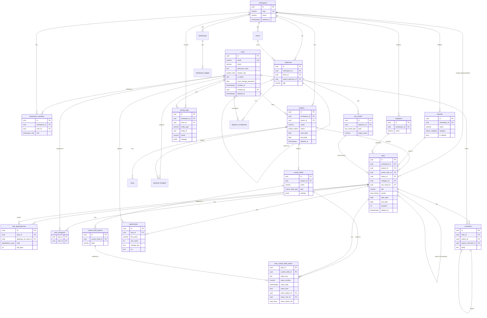

# Database architecture

PostgreSQL is the only permanent data store. The app never persists business
data in `localStorage`, JSON files or in-memory arrays. The request path is
always **Browser → Next.js route handler (authz) → Prisma → PostgreSQL**.

- Schema: [`prisma/schema.prisma`](../prisma/schema.prisma)
- Migrations: [`prisma/migrations/`](../prisma/migrations). The schema is only
  changed through migrations (`prisma migrate dev` locally, `prisma migrate
  deploy` in CI/Vercel builds). Rules Prisma cannot express (CHECK
  constraints, partial unique index, integrity triggers) live in
  `20260926140100_constraints_and_triggers`.
- Credentials: `DATABASE_URL` (pooled, runtime) and `DIRECT_URL` (direct,
  migrations) come from environment variables only.

## Entities

| Table | Purpose | Delete strategy |
|---|---|---|
| `users` | Accounts. `system_role` = `ADMIN` / `MEMBER`. Only admins create accounts. | Deactivate (`is_active`) + `deleted_at` |
| `workspaces` | Tenant boundary. | Soft (`deleted_at`) |
| `workspace_members` | User ↔ Workspace with `workspace_role` | Hard |
| `teams` | Groups inside a workspace (for goals) | Hard |
| `projects` | Container of tasks, custom fields and views | Soft |
| `statuses` | Workspace workflow states; `category` (todo/in_progress/done/cancelled) drives progress and "done" logic | Hard, `RESTRICT` while tasks use it |
| `categories` | Workspace task categories | Hard, tasks `SET NULL` |
| `tasks` | The work item | Soft (`deleted_at`, `deleted_by`) |
| `task_assignees` | Task ↔ User | Hard |
| `task_dependencies` | Task → Task (depends on) | Hard |
| `custom_fields` | Per-project field definitions | Soft |
| `custom_field_options` | Options of select fields | Hard, values `SET NULL` |
| `task_custom_field_values` | One row per (task, field), typed value columns | Hard |
| `comments` | Task comments, threaded | Soft |
| `attachments` | File metadata + object-storage URL/key | Soft (blob removed from storage) |
| `activity_logs` | Append-only audit trail | Never updated (trigger) |
| `views` | Saved view configuration per project | Hard |
| `dashboards`, `dashboard_widgets` | Analytics layout | Hard |
| `objectives`, `key_results`, `objective_contributors` | Goals (OKR) | Soft (objectives, key results) |
| `captured_thoughts` | Quick-capture inbox before a thought becomes a task | Hard / archived |

## Relationships

- **One-to-many:** workspace → projects, statuses, categories, tasks, teams,
  objectives, dashboards; project → tasks, custom_fields, views; status →
  tasks; category → tasks; custom_field → options, values; task → comments,
  attachments; objective → key_results; key_result → tasks; dashboard →
  widgets; user → comments, attachments, activity_logs.
- **Many-to-many:** users ↔ workspaces (`workspace_members`), tasks ↔ users
  (`task_assignees`), objectives ↔ users (`objective_contributors`), tasks ↔
  custom fields (`task_custom_field_values`).
- **Self-referencing:** `tasks.parent_task_id` (subtasks),
  `task_dependencies` (task ↔ task, many-to-many), `comments.parent_comment_id`
  (replies), `objectives.parent_objective_id` (cascading goals),
  `users.created_by` / `updated_by`.

## Entity relationship diagram

## Constraints and integrity

- **Primary keys:** UUID (`gen_random_uuid()`) everywhere. Join tables
  (`task_assignees`, `objective_contributors`, `task_custom_field_values`)
  use a composite PK.
- **Unique:** `users.email` (stored lowercase, enforced by CHECK),
  `workspaces.slug`, `(workspace_id, user_id)` on members, `(workspace_id,
  name)` on statuses/categories/teams, `(task_id, depends_on_task_id)` on
  dependencies, one `is_default` status per workspace (partial unique index).
- **CHECK:** non-blank names/titles, progress 0–100, confidence 0–100, date
  ranges (`due_date >= start_date`), positive weights, non-negative sizes and
  durations, no self-dependency, no self-parenting, lowercase email and slug
  format.
- **Triggers (tenant integrity):** a task's project/status/category/parent/
  key result must be in the task's workspace; dependencies only inside one
  workspace; assignees must be workspace members; custom field values only
  for fields of the task's project and options of that field;
  `activity_logs` rejects UPDATE.
- **Application rules:** dependency cycles (A→B→A) are rejected by the API
  with a graph walk before insert.

## Indexes (by query)

| Query | Index |
|---|---|
| Project task list (grid/kanban/...) | `tasks (project_id, deleted_at, sort_order)` |
| Overdue / due-soon across a workspace | `tasks (workspace_id, deleted_at, due_date)` |
| My tasks | `task_assignees (user_id)` |
| Key result rollup | `tasks (key_result_id)` |
| Subtasks | `tasks (parent_task_id)` |
| What blocks X | `task_dependencies (depends_on_task_id)` |
| Filter/sort on custom fields | `task_custom_field_values (custom_field_id, value_number / value_date / value_option_id)` |
| Task timeline | `comments (task_id, created_at)`, `attachments (task_id, deleted_at)` |
| Audit screens | `activity_logs (workspace_id, created_at desc)`, `(entity_type, entity_id, created_at desc)` |
| Membership check on every request | unique `(workspace_id, user_id)` + `workspace_members (user_id)` |

## Authorization

Enforced in route handlers through `src/lib/authz.ts`, never only in the UI:

- Every request re-loads the user from the database; deactivated or deleted
  users are rejected even with a valid session cookie.
- `ADMIN` (system role): manage users, create workspaces, full access.
- Workspace roles: `owner`/`admin` manage members, statuses, categories,
  projects; `editor` manages tasks, custom fields and views; `contributor`
  creates tasks and edits tasks they created or are assigned to; `viewer`
  reads and comments.
- Every resource is resolved to its workspace first, then the caller's role
  in that workspace is checked. The database triggers above stop
  cross-workspace references even if a route had a bug.

## Risks and scalability notes

1. **Grid filtering runs in the application layer.** A project's tasks are
   loaded then filtered/sorted in the browser. Fine to low tens of thousands
   of tasks per project; beyond that, push filters to SQL (the indexes above
   already support the common ones) and paginate.
2. **Custom fields are typed EAV.** Sorting/filtering by many custom fields at
   once means one join per field. Indexed per type, acceptable for tens of
   fields; don't turn custom fields into the primary data model.
3. **`tasks.workspace_id` is denormalized** for tenant indexes. A trigger keeps
   it consistent with the project; moving a task across workspaces is not
   supported.
4. **`activity_logs` grows without bound.** Plan partitioning by month or an
   archival job once it reaches millions of rows.
5. **Soft delete + unique names.** Soft-deleted projects/custom fields don't
   block reuse because their names are not unique-constrained; statuses and
   categories are hard-deleted so their unique names stay meaningful.
6. **Connection limits on serverless.** Use Supabase's transaction pooler for
   `DATABASE_URL` (`?pgbouncer=true&connection_limit=1`) and the direct/session
   URL for `DIRECT_URL`.
7. **Attachments** are stored in a private Vercel Blob store and streamed
   through `/api/attachments/[id]/download` after an authorization check
   (always `Content-Disposition: attachment`, active content types blocked).
   Server uploads are capped at 4 MB by the Vercel function body limit; larger
   files need client-side uploads with signed tokens.
8. **Polymorphic `activity_logs.entity_id`** has no FK by design (history must
   outlive deleted rows); integrity of that column is by convention.
9. **No login rate limiting yet.** Credentials sign-in relies on bcrypt cost
   and generic error messages; add IP/account throttling (e.g. an edge rate
   limiter) before exposing the app publicly.
10. **Public form views** accept anonymous submissions for forms explicitly
    marked public; they are not rate-limited either.
11. **Migrating from the previous version** drops the old dynamic
    `Base/TableDef/Field/Record` tables (migration
    `20260926140000_normalized_relational_schema`). Export anything you need
    first.
